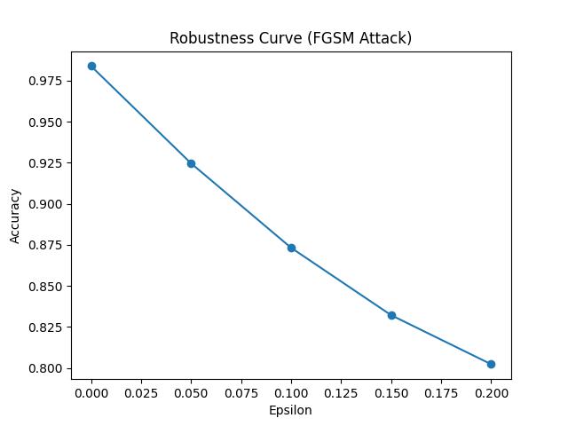
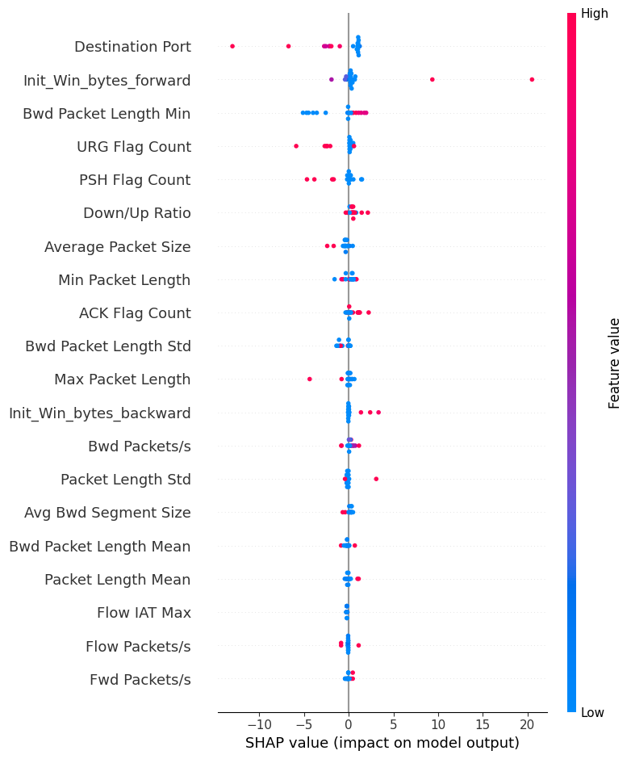

# XAI-CTI — Explainable AI for Cyber Threat Intelligence

> A hybrid deep learning system that detects network intrusions, explains its decisions, and defends itself against adversarial attacks.

---

## Overview

Modern networks face increasingly sophisticated cyber threats, yet most intrusion detection systems are black boxes — they raise an alert but offer no explanation for *why*. **XAI-CTI** addresses this gap by combining a high-accuracy deep learning model with explainability tools (SHAP) and symbolic reasoning, so security analysts can understand and trust every decision the system makes.

The model classifies network traffic as **BENIGN** or **ATTACK**, outputs a **threat level** (HIGH / MEDIUM / LOW), lists the **top contributing features**, and provides a **human-readable symbolic explanation** — all in one pipeline.

It is also trained using **adversarial hardening (FGSM)**, making it robust against attackers who may try to manipulate model inputs to evade detection.

---

## Key Features

- 🔍 **Binary classification** — BENIGN vs ATTACK traffic detection
- 🧠 **Hybrid CNN + Transformer model** — captures both local patterns and global feature relationships
- 📊 **SHAP-based explainability** — identifies which network features drove each prediction
- 🔣 **Symbolic reasoning layer** — translates model decisions into human-readable threat explanations
- 🛡️ **Adversarial training (FGSM)** — model hardened against gradient-based adversarial perturbations
- ⚡ **GPU-accelerated training** — auto-detects CUDA; falls back to CPU

---

## Tech Stack

| Category | Technologies |
|---|---|
| **Deep Learning** | PyTorch 2.2 |
| **Explainability** | SHAP 0.44 |
| **Data Processing** | Pandas, NumPy, scikit-learn |
| **Visualisation** | Matplotlib, Seaborn |
| **Serialisation** | joblib (scaler), PyTorch `.pth` (model) |
| **Language** | Python 3.10+ |

---

## Architecture & Workflow

```
Raw CSV (CIC-IDS Dataset)
         │
         ▼
  preprocessing.py
  ├─ Strip whitespace from column names
  ├─ Encode labels: BENIGN → 0, ATTACK → 1
  ├─ Drop NaN / Inf values
  ├─ StandardScaler normalisation
  └─ 80/20 train-test split → PyTorch tensors
         │
         ▼
  XAI_CTI_Model (model.py)
  ├─ Conv1D  → extracts local feature patterns
  ├─ TransformerEncoder → global feature relationships
  └─ Linear(32 → 2)  → class logits
         │
    ┌────┴────────────────────┐
    ▼                         ▼
Standard Training        Adversarial Training (FGSM)
(train_gpu.py)           (train_adversarial.py)
    │                         │
    ▼                         ▼
xai_cti_model.pth      xai_cti_model_adv.pth
                              │
         ┌────────────────────┼────────────────────┐
         ▼                    ▼                     ▼
   SHAP Explainer       Symbolic Rules        Robustness Curve
  (explain_shap.py)     (symbolic.py)       (robustness_curve.py)
  shap_summary.png     Threat Level           robustness_curve.png
```

**How a prediction works (demo pipeline):**
1. A network flow sample is loaded and scaled.
2. The adversarially trained model predicts BENIGN or ATTACK with a confidence score.
3. Confidence ≥ 0.9 → **HIGH**, < 0.9 → **MEDIUM**, no attack → **LOW** threat level.
4. SHAP values highlight the top 3 features that influenced the decision.
5. Symbolic rules translate feature names into plain-English threat descriptions.

---

## Installation & Setup

### Prerequisites
- Python 3.10 or higher
- (Optional) NVIDIA GPU with CUDA 11.8+ for faster training

### 1. Clone the repository
```bash
git clone https://github.com/your-username/XAI_CTI_Project.git
cd XAI_CTI_Project
```

### 2. Create and activate a virtual environment
```bash
python -m venv venv

# Windows
venv\Scripts\activate

# macOS / Linux
source venv/bin/activate
```

### 3. Install dependencies
```bash
pip install -r requirements.txt
```

### 4. Prepare the dataset

Download the **CIC-IDS 2017** dataset from the [Canadian Institute for Cybersecurity](https://www.unb.ca/cic/datasets/ids-2017.html) and place the daily CSV files inside the `data/` folder.

Then merge them into a single file:
```bash
python merge_fullweek.py
```
This produces `data/full_week.csv` (~920 MB).

---

## Usage

### Train the standard model
```bash
python train_gpu.py
```
Trains for 5 epochs and saves `xai_cti_model.pth`.

### Train the adversarially hardened model *(recommended)*
```bash
python train_adversarial.py
```
Saves `xai_cti_model_adv.pth`. This model is used by all downstream scripts.

### Run the full demo pipeline
```bash
python demo.py
```
Outputs a prediction, confidence score, threat level, top SHAP features, and a symbolic explanation for one attack sample.

### Generate the SHAP summary plot
```bash
python explain_shap.py
```
Saves `shap_summary.png`.

### Evaluate robustness against FGSM attacks
```bash
python adversarial_test.py
```

### Plot accuracy vs. attack strength
```bash
python robustness_curve.py
```
Saves `robustness_curve.png`.

---

## Example Output

```
========== XAI-CTI DEMO ==========

Prediction: ATTACK
Confidence: 0.9821
Threat Level: HIGH

Top Contributing Features (SHAP):
- Flow Bytes/s
- Total Fwd Packets
- Packet Length Mean

Symbolic Explanation:
- Abnormally high traffic volume detected
- Elevated packet transmission rate observed
- Suspicious packet size distribution

===================================
```

**Robustness Curve** — accuracy vs. FGSM epsilon:



**SHAP Summary Plot** — global feature importance:



---

## Folder Structure

```
XAI_CTI_Project/
│
├── data/
│   ├── Monday.csv              # Raw daily traffic captures
│   ├── Tuesday.csv
│   ├── Wednesday.csv
│   ├── Thursday_mor.csv
│   ├── Thursday_aft.csv
│   ├── Friday_mor.csv
│   ├── Friday_aft1.csv
│   ├── Friday_aft2.csv
│   └── full_week.csv           # Merged dataset (auto-generated)
│
├── model.py                    # CNN + Transformer model definition
├── preprocessing.py            # Data loading, cleaning, scaling
├── train_gpu.py                # Standard training script
├── train_adversarial.py        # FGSM adversarial training
├── adversarial_test.py         # Evaluate model under FGSM attack
├── explain_shap.py             # SHAP DeepExplainer & summary plot
├── symbolic.py                 # Symbolic reasoning & threat level
├── robustness_curve.py         # Accuracy vs epsilon plot
├── demo.py                     # End-to-end demo pipeline
├── merge_fullweek.py           # Merges daily CSVs
│
├── xai_cti_model.pth           # Saved standard model weights
├── xai_cti_model_adv.pth       # Saved adversarial model weights
├── scaler.pkl                  # Fitted StandardScaler
├── shap_summary.png            # SHAP feature importance plot
├── robustness_curve.png        # Robustness under FGSM plot
│
├── requirements.txt
└── README.md
```

---

## Challenges Faced

**1. Dataset scale** — The full CIC-IDS 2017 dataset spans ~920 MB after merging. Managing memory-efficient loading and preprocessing without OOM errors required careful use of pandas dtypes and batch processing.

**2. SHAP compatibility with custom PyTorch models** — SHAP's `DeepExplainer` requires model inputs and outputs to be standard tensors. The CNN reshape operations (`unsqueeze`, `permute`) needed to be wrapped carefully, and `check_additivity=False` was required to prevent false failures.

**3. Adversarial training stability** — Naively mixing clean and adversarial losses can destabilise training. Averaging the two losses `(loss + adv_loss) / 2` and using a small epsilon (0.01) during training while testing at larger epsilons (up to 0.2) struck the right balance between robustness and clean accuracy.

**4. Class imbalance** — The CIC-IDS dataset is heavily skewed toward benign traffic. Feature engineering and careful metric selection (F1, Precision, Recall alongside Accuracy) were important to avoid misleading results.

---

## Future Improvements

- [ ] **Multi-class classification** — detect specific attack types (DoS, Port Scan, Brute Force, etc.) instead of binary BENIGN/ATTACK
- [ ] **Real-time inference API** — wrap the model in a FastAPI service for live traffic stream analysis
- [ ] **Dashboard UI** — interactive Streamlit or Dash dashboard showing predictions and SHAP plots in real time
- [ ] **More XAI methods** — integrate LIME and Integrated Gradients alongside SHAP for richer explanations
- [ ] **Stronger adversarial training** — PGD (Projected Gradient Descent) and AutoAttack beyond FGSM
- [ ] **Model compression** — quantisation and pruning for edge deployment (IoT gateways, network routers)
- [ ] **Automated retraining pipeline** — periodically retrain on new traffic captures to handle concept drift

---

## References & Resources

### Research Paper
This project is based on the following research work:

- **[Hybrid Transformer-CNN Neuro-Symbolic Explainable AI for Cyber Threat Intelligence: Advancing Transparency and Adversarial Robustness](https://www.researchgate.net/publication/398320038_Hybrid_Transformer-CNN_Neuro-Symbolic_Explainable_AI_for_Cyber_Threat_Intelligence_Advancing_Transparency_and_Adversarial_Robustness)** — ResearchGate

### Dataset
The network traffic dataset used for training and evaluation:

- **[Network Intrusion Dataset](https://www.kaggle.com/datasets/chethuhn/network-intrusion-dataset)** — Kaggle

---

## Contributing

Contributions are welcome! To contribute:

1. Fork the repository
2. Create a feature branch: `git checkout -b feature/your-feature-name`
3. Commit your changes: `git commit -m "Add: brief description"`
4. Push to your branch: `git push origin feature/your-feature-name`
5. Open a Pull Request against `main`

Please ensure your code follows the existing style and includes comments where the logic is non-trivial. For major changes, open an issue first to discuss the approach.

---

## License

This project is licensed under the **MIT License** — see the [LICENSE](LICENSE) file for details.

---

## Author

**Anish Kanna**
- GitHub: [@Anish-Kanna](https://github.com/Anish-Kanna)

---

> *Built as part of a research project exploring the intersection of deep learning, cybersecurity, and explainable AI.*
